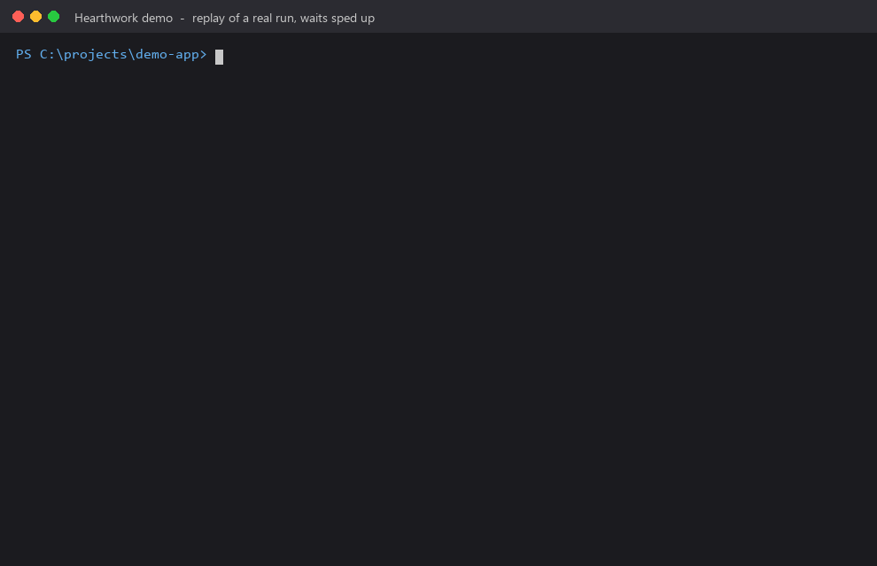
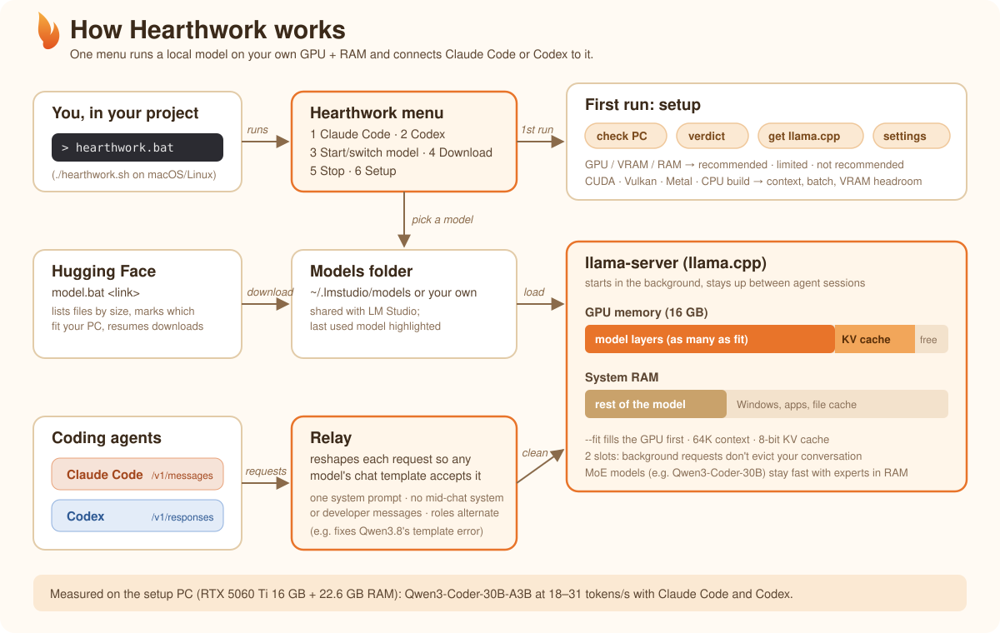

<p align="center"></p>

# Hearthwork

**Hearthwork runs a local AI model on your own computer and connects your coding agent to it, from one menu.** The model runs on your GPU and RAM, and the agent is Claude Code or Codex. It sets itself up for your hardware, tells you honestly whether your PC is good enough, and handles the small incompatibilities that otherwise break agents on local models.

Works on Windows, macOS and Linux. Needs Python 3.9+ and the agent(s) you want to use; no extra Python packages.

<p align="center"></p>
<p align="center"><sub>A replay of a real run on an RTX 5060 Ti 16 GB. Waits are sped up, the agent screens are simplified, and paths are shortened.</sub></p>

## How it works

<p align="center"></p>

## Quick start

From the project you want the agent to work on, run:

```
C:\path\to\hearthwork\hearthwork.bat     (Windows)
/path/to/hearthwork/hearthwork.sh        (macOS/Linux; run chmod +x *.sh once)
```

The first run sets things up (see below). After that you get one menu:

```
=== Hearthwork: local models for your coding agents ===
  Project:  C:\projects\my-app
  Model:    running  Qwen3-Coder-30B-A3B-Instruct-Q4_K_M  (port 8001)
  Computer: NVIDIA GeForce RTX 5060 Ti (16 GB), 22.6 GB RAM  recommended

  1) Claude Code
  2) Codex
  3) Start / switch model
  4) Download a model
  5) Stop the model server
  6) Benchmark the model: 8 graded coding tasks + scoreboard
  7) Setup: hardware check, llama.cpp update, models folder
  q) Quit
```

- **Picking an agent** starts the model if none is running: you pick it (the last used is highlighted, Enter keeps it), it loads in the background, and then the agent opens in this terminal, in your project folder. Exit the agent to come back to the menu.
- **The model server keeps running** between agent sessions, so switching between Claude Code and Codex is instant. Both can use it at the same time. On Windows it runs in its own window, which shows its log.
- **On quit** it asks whether to stop the server.
- **Skip the menu:** `hearthwork.bat claude` / `hearthwork.bat codex`.

| Commands (Windows · macOS/Linux) | What they do |
|---|---|
| `hearthwork.bat` · `./hearthwork.sh` | The menu above. |
| `start.bat` · `./start.sh` | Runs the model server in this terminal; Ctrl+C stops it. |
| `claude.bat` · `./claude.sh` | Claude Code with the running server. Extra arguments go to `claude`. |
| `codex.bat` · `./codex.sh` | Codex with the running server. Extra arguments go to `codex`, e.g. `codex.bat exec "..."`. |
| `model.bat <link>` · `./model.sh <link>` | Downloads a model from Hugging Face. |
| `setup.bat` · `./setup.sh` | Runs setup again. `--update-llama` gets the newest llama.cpp. |
| `bench.bat` · `./bench.sh` | Benchmarks the running model through an agent (`--agent claude\|codex`); `--show` prints the scoreboard. |
| `check.bat` · `./check.sh` | Checks whether this PC suits Hearthwork and which models fit (see below). |

- **Faster first messages:** each agent's processed system prompt is saved to `cache/slots/` when a session ends or the server stops, and restored when the server starts. Measured: the first message after a restart went from 28 s to 13 s (Claude Code) and from 25 s to 17 s (Codex).

## Benchmark

`bench` (or menu option 6) drives the running model through Claude Code or Codex in a fresh folder, with 8 prompts in one conversation. It grades each step by checking the files and running the code, not by trusting the agent's reply:

| # | Task | Graded by |
|---|---|---|
| 1 | chat | a reply came back |
| 2 | list files | both files named |
| 3 | read a file | the secret phrase is in the reply |
| 4 | write + run `fizzbuzz.py` | running it gives the exact FizzBuzz output |
| 5 | add `is_prime` + run | function and docstring exist, FizzBuzz still right, the primes below 30 are printed |
| 6 | fix 3 planted bugs | `buggy.py` prints `20.0`, `[9, 5]`, `0` |
| 7 | write unit tests | `test_buggy.py` passes. Half points if it copies the functions instead of importing `buggy.py` |
| 8 | summary | names all 3 files |

- **Results** are added to `bench/results.jsonl`. The scoreboard ranks every model and agent you have tried, by score and then time.
- **Each run's folder** stays in `bench/runs/`, so you can inspect what the agent wrote.

## Agents

| Agent | How it connects | Notes |
|---|---|---|
| Claude Code | Anthropic Messages API (`/v1/messages`) | Told the real context size, so it compacts in time. |
| Codex | OpenAI Responses API (`/v1/responses`), as a one-off model provider through `-c` overrides | `~/.codex/config.toml` is not changed. Codex prints "Model metadata ... not found" for any non-OpenAI model; that is expected. |

- **Every agent goes through a small relay** inside the launcher (`harnesses.py`). It reshapes requests so any model's chat template accepts them.
- **Why the relay is needed:** strict templates (e.g. Qwen3.5/3.8) reject a second system/developer message, unknown roles, or two user messages in a row, and both agents send these. Without the relay, Claude Code and Codex requests failed on Qwen3.8 with "System message must be at the beginning".
- **Adding another agent** means adding one launch function to `HARNESSES` in `harnesses.py`.

## First run: setup (onboarding)

`hearthwork` (or `start`) runs setup automatically when nothing is configured yet. It:

1. **Checks the computer:** OS, CPU, RAM, and GPU (NVIDIA / AMD / Intel / Apple) with its memory.
   - For AMD/Intel GPUs it reads the GPU's own memory, so integrated graphics aren't mistaken for a real GPU.
2. **Judges whether a local model is worth it here**, and says why:
   - **RECOMMENDED** (continues): a GPU with ≥12 GB and ~26 GB+ of GPU memory + RAM usable for models, or a Mac with ≥32 GB.
   - **LIMITED** (asks; default yes): a 6–12 GB GPU or tight memory. Expect roughly 5–15 tokens/s, or a smaller, weaker version of the model.
   - **NOT RECOMMENDED** (asks; default no, nothing is downloaded): no GPU, an integrated-only GPU, or under ~18 GB usable. Recommends cloud Claude Code instead.
   - The reference point is measured: RTX 5060 Ti 16 GB + 22.6 GB RAM ran Qwen3-Coder-30B at 18–31 tokens/s. The thresholds for other hardware are estimates from that.
3. **Gets llama.cpp.** It uses one already in `bin/` or on PATH. Otherwise it downloads the newest official build that matches the hardware:
   - CUDA for NVIDIA. The CUDA 13 or 12 build is chosen from the driver.
   - Vulkan for AMD and Intel.
   - Metal on macOS.
   - CPU if there is no GPU.
4. **Asks for the models folder.** It finds LM Studio's folder and offers it, so both tools share the same files.
5. **Picks settings for this hardware:** context 64K (32K below ~24 GB GPU memory + RAM), prompt batch size, VRAM headroom, and an 8-bit KV cache.
6. **Saves everything to `config.json`.** If there are no models yet, it suggests one, with the command to download it.

Delete `config.json` (and `bin/`) to set up from scratch, for example when copying this folder to another computer.

## Options

- `start --model <part of a file name>` skips the model menu.
- `start --context N` overrides the context for that run.
- `claude --max-output N` caps the length of each Claude Code reply (default 4096 tokens). Codex has no such setting.
- **Agent settings stay local:** `claude` and `codex` only change settings for that agent process, never your terminal or the agent's own config files.

## Downloading models

```
model.bat https://huggingface.co/unsloth/Qwen3-Coder-30B-A3B-Instruct-GGUF     (a repo: lists files, you pick one)
model.bat unsloth/Qwen3-Coder-30B-A3B-Instruct-GGUF                            (same, short form)
model.bat https://huggingface.co/<org>/<repo>/blob/main/<file>.gguf            (one file)
```

- **The repo list** shows each file's size, smallest first, and whether it fits this computer:
  - fits in GPU memory (fastest),
  - GPU + RAM (slower; fine for MoE models),
  - too big.
- **Files are saved to `<models folder>/<org>/<repo>/`,** LM Studio's layout.
- **Multi-part models** download all their parts.
- **Interrupted downloads** resume when you run the same command again.
- **Gated or private repos:** set `HF_TOKEN`.

## How resources are used

- **GPU first.** llama.cpp's `--fit` puts as much of the model on the GPU as fits, keeping `fitTargetMiB` free for the desktop, and runs the rest from RAM. It does this on every start, so it adapts to each model and machine.
- **Context:** it stays at what Claude Code needs, not as large as possible. Claude Code's own prompt is ~20K tokens, so 32K makes it compact after one message. A bigger context than needed only pushes model layers off the GPU and makes it slower.
- **Other settings:**
  - Prompt batch 4096 on 12 GB+ GPUs: a 20K-token prompt took 84 s at 512 and 26 s at 4096.
  - 2 slots, so Claude Code's background requests don't evict the conversation's cache.
  - The model's RAM part is loaded into RAM rather than memory-mapped from a possibly slow disk.
- **Where to change them:** the `server` section of `config.json`. `setup` recalculates them.

## Models

- **Requirements:** any GGUF model works if it supports tool calling (Claude Code reads, edits and runs things through tools) and fits.
  - Mixture-of-experts (MoE) models, like Qwen3-30B-A3B, stay fast even partly in RAM.
  - Dense models slow down a lot once they spill out of GPU memory.
- **Any model's chat template is handled.** `claude.py` relays Claude Code's requests and moves the `system` message Claude Code places mid-conversation into the neighbouring user message, because strict templates reject it ("System message must be at the beginning").
  - Escape hatch for a template broken in some other way: put a fixed copy at `templates/<model file name without .gguf>.jinja`.

## Measured on the setup PC (RTX 5060 Ti 16 GB over PCIe 4.0 x4, 22.6 GB RAM, 2026-10-06/07)

| Model | Generation speed | Notes |
|---|---|---|
| Qwen3-Coder-30B-A3B Q4_K_M (MoE, 17.3 GB) | 18–31 tokens/s | First Claude Code message ~20–40 s. Completed the 8-task bench: read, create, run, edit, fix 3 bugs, write tests. |
| Huihui-Qwen3.8-27B-abliterated Q3_K (dense, 12.6 GB) | ~6 tokens/s | Works through the relay. Dense and partly in RAM at 64K, so slower. |

For comparison, a disk-streaming engine built on AirLLM ran the same Qwen3-Coder model about 10x slower on this PC.

## Check your PC first

See whether Hearthwork is worth it on a computer, and which model to use, without installing anything:

```
uvx --from git+https://github.com/BillyMRX1/hearthwork hearthwork-check
```

It shows the hardware, the verdict, installed agents, and the best version of each suggested coding model that fits (sizes live from Hugging Face). Inside a Hearthwork folder: `check.bat` / `./check.sh`.
